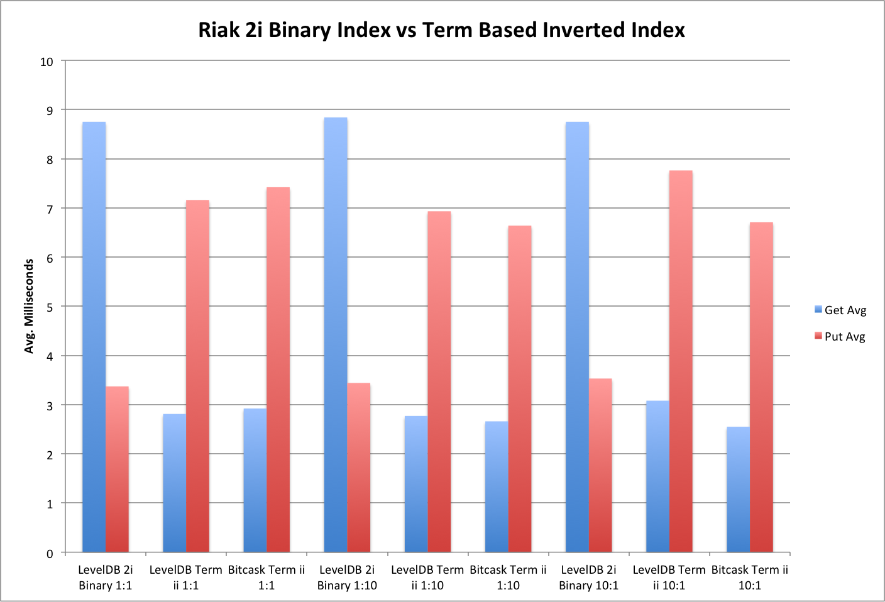
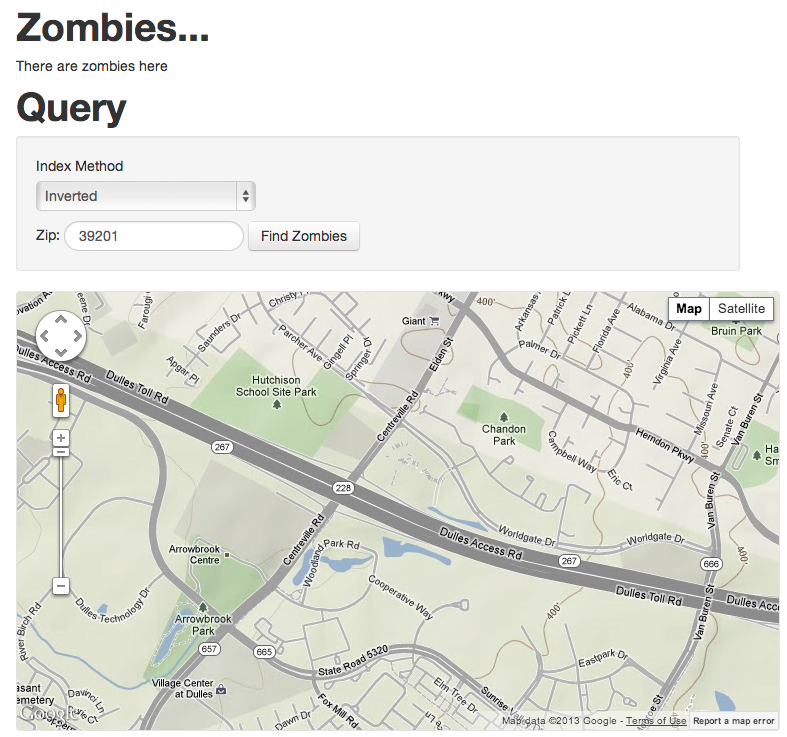
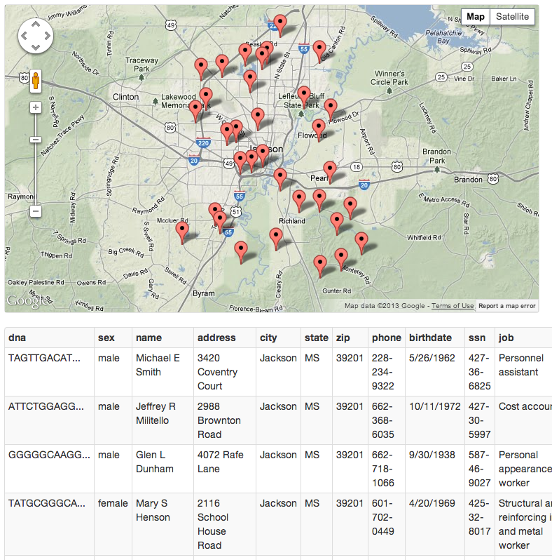
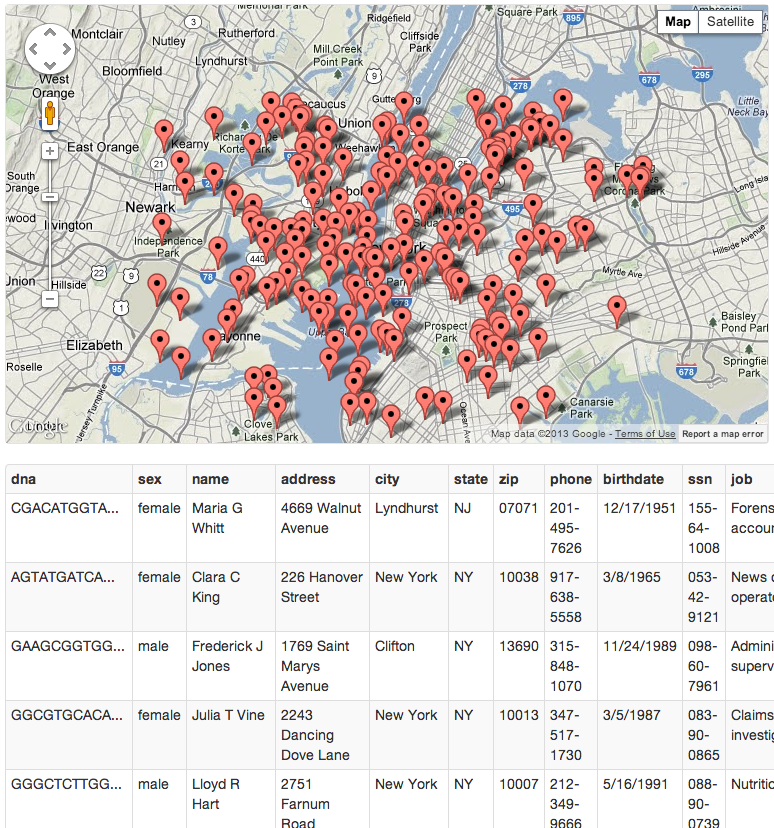

# Inverted Indexes/Indices for Riak

### What is an Inverted Index?

In the context of Riak, an index is a term that you can query on which references the keys of other Riak Objects.  Riak already has something called Secondary Indexes but they're only available when using the LevelDB backend.  An Inverted index is simply a Riak Object where the Key is the index term and the value is a serialized list of keys.

### Why use an Inverted Index instead of Riak's built in Secondary Indexes or storing a key?

#### Pros:  

- Inverted Index key retrievals are faster than Secondary Index lookups.
- Inverted Indexes can be implemented on any backend, including Bitcask and Memory, but Secondary Indexes can only be used with the LevelDB backend.
- Use of siblings and sibling resolution is accepted as the correct way to handle issues surrounding distributed data storage.  See Aphyr's Call Me Maybe (1) series of blog posts for a thorough discussion of issues.
- Since this implementation of an Inverted Index is built on top of a CRDT (2), the sibling resolution strategy is deterministic and built into the implementation.
- 2i has overhead, that Inverted Indexes do not, which needs to be considered when planning large Riak clusters with more than 512 partitions.
- Ideal for read-heavy applications since Inverted Index retrieval is simply an additional Riak Get operation.

#### Cons: 

- Indexes could potentially grow to very large sizes, necessitating index partitioning which adds to implementation complexity and total operation count.
- In this basic implementation, siblings are only merged when an index retrieval operation takes place. Low cardinality in the index term-space results in a potentially large number of siblings between reads which will cause a high latency when a read does eventually occur.
- 2i allows for some basic searching (integer ranges, binary partial, exact match) and a few built in Map/Reduce facilities.  Our implemenation for Inverted Index offers nothing but exact match searching.  A viable strategy that incorporates Inverted Indexes would be to create partial term indexes which point to the terms of other indexes.  An example would be City_3 (containing the first 3 letters of a City, State combination) index which points to the City index, an index referring the values which have a particular City, State.
- Less ideal for write heavy applications since for each index, and additional put operation is required so to store 1 Riak Object with 3 indexes, a total of 4 puts are required.

### Metrics:

We wrote a basic ruby script to test creation and retrieval of 2i binary indexes and Inverted Indexes using 1:1, 10:1, and 1:10 Get:Put ratios against and 11 node Riak K/V cluster.  The cluster was cleared of data between each 10 minute run.  The index term was simply a sequential integer converted to a string for the index put and the index term for the index get operation was a randomly selected integer from the term-space that had already been written.

Overall, our expecations were fulfilled.  An Inverted Index retrieval is faster than a 2i retrieval and a 2i store is faster than a Inverted Index store.

# !!! Put in Metrics data

### Potential Use Cases:

- Reference all orders belonging to a customer
- Save the users who liked something or the things that a user liked.
- Tag content in a Content Management System
- Store a Geo Hash of a specific length for fast geographic lookup/filtering without expensive Geospatial operations
- Reference for time series data where all observations collected within a time-frame are referenced in this particular index.

### Implementation:

We implemented our Inverted Index as a CRDT G-Set (Grow only Set) and added the index logic into Riak Ruby Client (3) so that adding an Inverted Index is as easy as adding a 2i i.e., {INDEX_NAME}\_bin for a binary 2i and {INDEX_NAME}\_inv for an inverted index.

In the Ruby Client, the InvertedIndex class (4) handles bucket creation index put and get operations as well as sibling resolution.  The GSet class (5) has the actual CRDT GSet implementation which is just a thin facade on top of a Ruby Set data type with some serialization and merge provisions.  The only performance specific optimization that we made from the client defaults was to disable the Riak Object return when storing the index within Riak.  When the number of siblings accumulated during a data load, due to sibling resolution only taking place on an index retrieval, the index put operation time would increase since all siblings were being returned to the client. 

### Room for Improvement:

- A Grow Only Set (G-Set) has no provision for deleting. Replacing the G-Set with another CRDT Set such as an Observed-Remove Set (OR-Set) would provide this capability.
- This behavior could be potentially be built into Riak or as an Riak Core application deployed alongside Riak nodes to mitigate latency impact of sibling resolution taking place on the Riak Client side.
- Optimize R, W, PR, PW, DW bucket and read/write settings for maximum throughput.

### Expansion:

- Take advantage of the excellent distributed properties of Riak and implement other CRDTs such as counters, registers, and graphs.

### Demonstration:

#### Zombies!

The Zombie infestation has taken hold in the United States.  The CDC has collected first 1 million of the casualties and has enlisted your assistance loading the data into their Riak cluster and analyzing the results.

To provide ground teams with fast access to the data we've developed a web application (6) and loaded the data into Riak using Inverted Indexes for both the Zip code and a GeoHash (7) for fast geographic lookups.

##### The application allows users to Search with Zip-code or click on the Map:

##### Searching for Zombies in the Zip Code 39201 yields the following:

##### Clicking on Downtown New York confirms your fears and suspicions:

The geographic bounding inherent to GeoHashes is obvious in a point-dense area so in this case it would be best to query the adjacent GeoHashes.

### References:

1. [Aphyr Call Me Maybe](http://aphyr.com/posts/281-call-me-maybe-carly-rae-jepsen-and-the-perils-of-network-partitions)
2. [CRDT Paper](https://www.google.com/url?sa=t&rct=j&q=&esrc=s&source=web&cd=1&cad=rja&ved=0CC4QFjAA&url=http%3A%2F%2Fhal.upmc.fr%2Fdocs%2F00%2F55%2F55%2F88%2FPDF%2Ftechreport.pdf&ei=8M6kUc3IGMHr0gGn94CIBw&usg=AFQjCNFIGtjVlEQx6SsKH9mN30e0Dg_5cg&bvm=bv.47008514,d.dmQ)
3. [Riak Ruby Client (broker-inverted-index branch)](https://github.com/basho/riak-ruby-client/tree/broker-inverted-index)
4. [InvertedIndex Class](https://github.com/basho/riak-ruby-client/blob/broker-inverted-index/lib/riak/index/inverted_index.rb)
5. [GSet Class](https://github.com/basho/riak-ruby-client/blob/broker-inverted-index/lib/riak/crdt/gset.rb)
6. [riak-inverted-index-demo](https://github.com/drewkerrigan/riak-inverted-index-demo)
7. [Geohash Wiki Page](http://en.wikipedia.org/wiki/Geohash)

